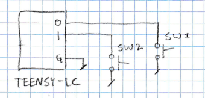
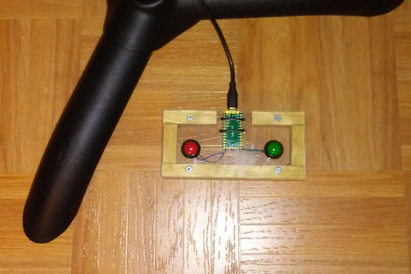

# PgUpDnPedal
Page turning pedal

Francis Deck, Dec. 7, 2020

This is a simple design for a page turning pedal. Its most likely use is reading sheet music on a tablet device. I wanted to try reading music from a tablet, just to see if I can stand the tiny screen. I'm a jazz double bassist, so my hands are occupied when I'm playing, and while it's easy to flip pages on paper charts, it can be frustrating on a tablet. You can buy a Bluetooth pedal for this purpose, but I decided to quickly whip one up of my own.

It's based on Teensy LC, a low cost microcontroller development board. For hardware, all it needs are two pushbutton switches and a housing. The Teensy LC is intended to be programmed in the Arduino development environment, and it comes with libraries for emulating a USB keyboard. So the pedal is just a two button keyboard!

I really like the Teensy family of boards. You can treat them "like an Arduino" using the standard libraries, and a lot of Arduino code will run on them directly. But Arduino is just a thin wrapper around GCC, and the Teensy libraries expose the entire register space of the microcontrollers, so it's easy to reach bare metal and make use of the full functionality of the chips at top performance.

Circuit design

Here it is, in all its glory: A Teensy LC and two pushbutton switches. The numbers 0 and 1 refer to the numbers silk-screened onto the bottom of the Teensy LC board. G is ground. The switches are plain momentary contact pushbutton switches.

And here's the build. I made the enclosure out of wood and a piece of Lexan from my scrap bin.

Arduino code is in the PgUpDn folder. To use it, you need to install the latest version of Arduino on your PC, as well as the Teensyduino package from PJRC. As a note to the un-initiated, Arduino is considered to be "easy" for enthusiasts, but if you're a complete beginner at this stuff, there's actually a fairly steep learning curve.

When you get Arduino and Teensyduino installed, you can open the source code file, and you'll need to choose some settings:

  Tools --> Board --> Teensyduino --> Teensy LC
  USB Type --> Keyboard
  
The first setting tells it you've got a Teensy LC, among the many possible Teensy boards. The second tells it to add USB keyboard emulation firmware to the libraries that are available to your program.
  

I will add some more detailed instructions on where to find the tools that you need, but for now, this is it.
