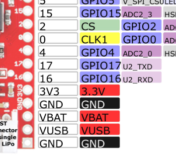
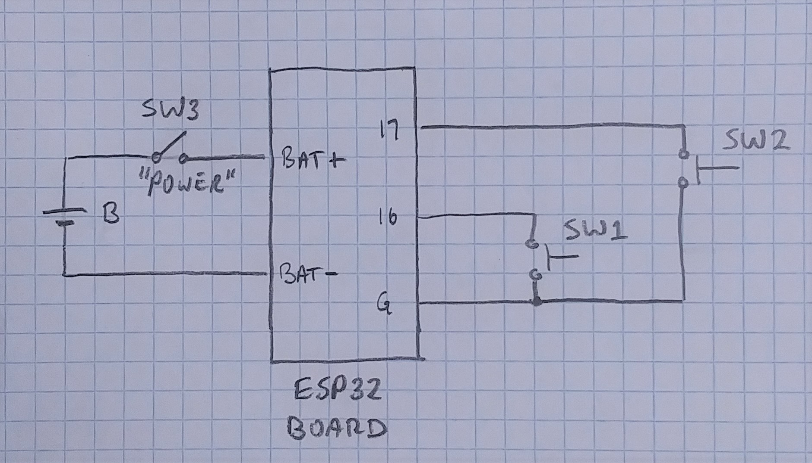
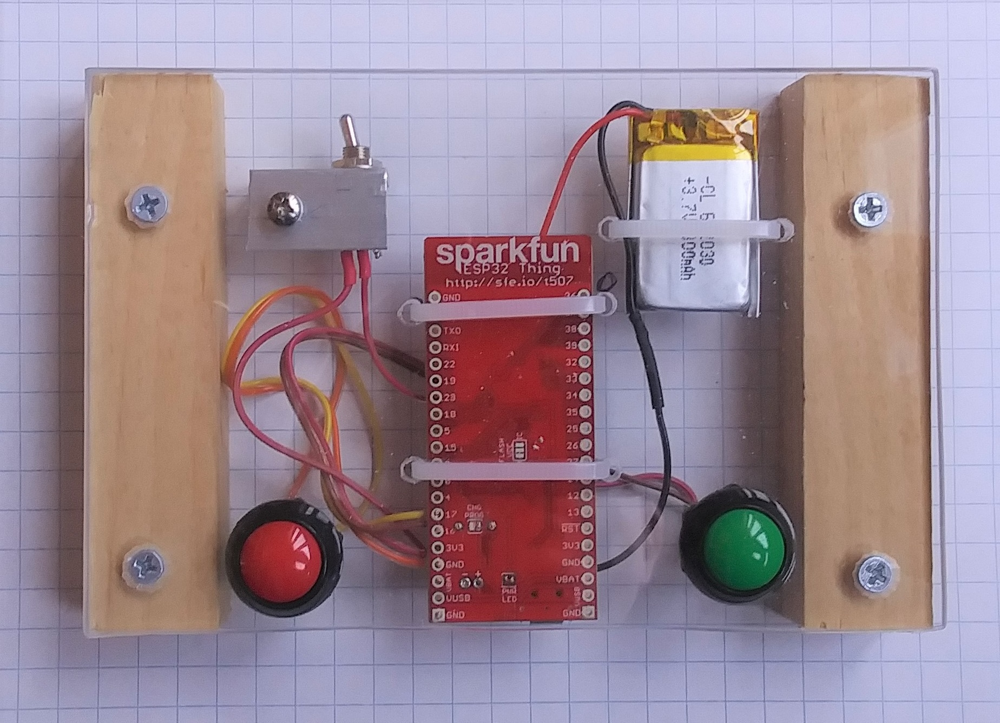
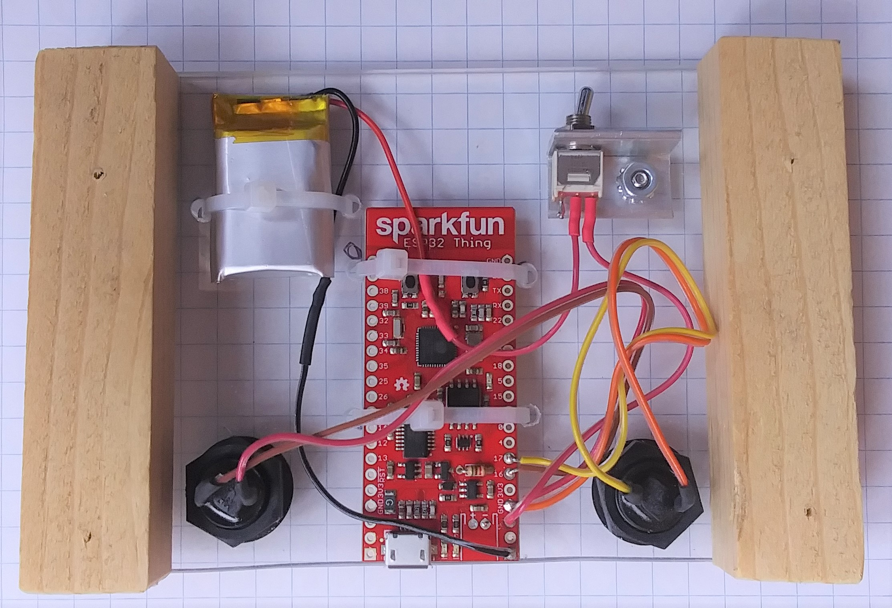
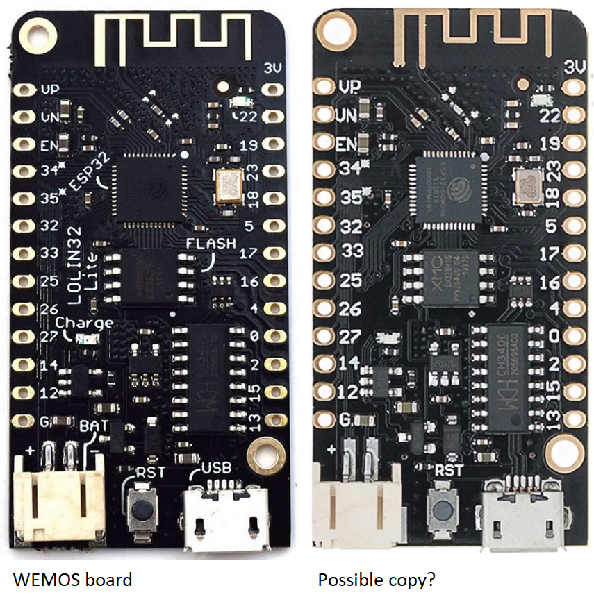
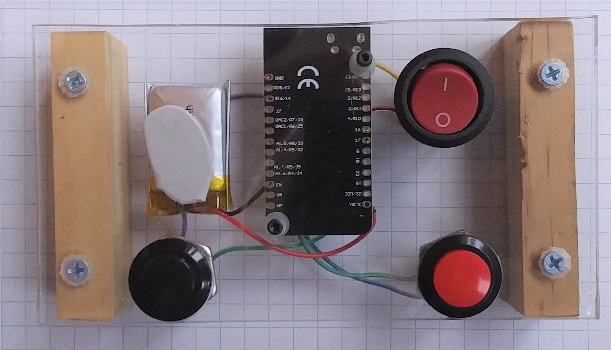
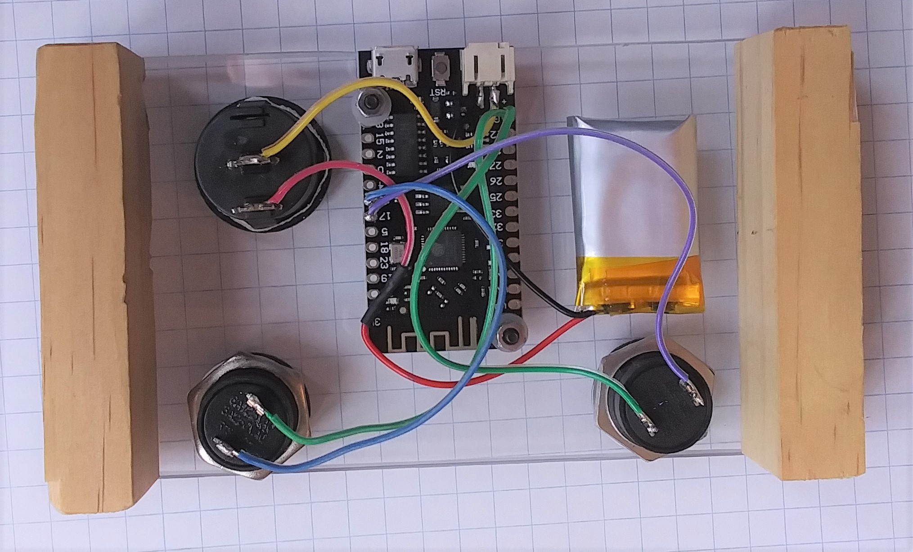

# PgUpDnPedal

## Page turning pedal based on ESP32 microcontroller

Francis Deck, Dec. 7, 2020

### Purpose

Bluetooth enabled page turning pedal, for reading sheet music on a tablet device.

### Status of project

It seems to work based on limited testing, but is strictly a proof-of-concept. It has not been approved by an engineer or tested for regulatory compliance.

Pairing seems to work better on my Windows tablet than on my notebook computer. That will require some investigation.

I explored an alternative design using cheaper parts from an overseas supplier, and while it also seems to work, some of the resulting issues make me lean towards recommending the somewhat more expensive components from the US supplier.

*If you're reading this page and it's more than a few months old, make sure the parts are still available.*

### Audience

For now, fairly advanced hobbyists who are comfortable with basic circuit construction such as soldering, and working with the Arduino development environment, plus use of test equipment such as a voltmeter. 

If you're just looking for a way to avoid paying the full cost of a commercial page turning pedal, this is probably not a good project for you. The tools that you'll need will cost more than a pedal.

### Motivation

I wanted to try reading music from a tablet, just to see if I can stand the tiny screen. I'm a jazz double bassist, so my hands are occupied when I'm playing, and while it's easy to flip pages on paper charts, it can be frustrating on a tablet. You can buy a Bluetooth pedal for this purpose, but I wanted to see if I could make one.

For non-musicians, "reading" in this context means *sight-reading* which is the specialized art of *playing music directly from a written source*. Many musicians, for instance in folk or rock music, or the production of electronic music, will never need to sight-read.

### Design strategy

Microcontrollers (MCUs) have become the centerpiece most electronics projects. They have revolutionized both commercial and hobby electronics. But because microcontrollers need to be programmed, many projects turn into coding projects.

The **Arduino** project, beginning in the 2000's, introduced a hobbyist friendly MCU development platform, and a community grew up around it. Today, "Arduino" has evolved into a software development tool supporting dozens of different hardware boards. People have shared huge amounts of tutorial information and projects, ranging from useful to insane.

A MCU can be hard to work with by itself. The chips often come in packages that cannot be soldered by mere mortals, and are supported by datasheets that require a background in both electronics and computer architecture to understand. Most hobbyists prefer to start with *development boards*, which are a microcontroller on a circuit board that provides convenient physical connections and a port for programming via USB. The board vendors usually provide support for programming in the Arduino environment.

A typical design strategy is: 

1. Choose a MCU board that performs as many of the functions needed for your project as possible
2. Implement the rest of the design with circuitry connected to the MCU
3. Write the program that controls the MCU

Almost every hobbyist design involving any kind of radio communications (Bluetooth, WiFi, etc.) uses the same platform: The Espressif ESP32 microcontroller (MCU) chip. This is a 32 bit MCU with built-in wireless capability, and generous support through libraries that can be used within the Arduino development environment.

I chose the "ESP32 Thing" board from Sparkfun Electronics. because I had some in my spares bin. There's a new version of this board, the "ESP32 Thing Plus" that should work as well. It uses a newer version of the ESP32 chip.

Now a circuit board with a bunch of numbered pins and cryptic markings could seem a bit forbidding to decipher. Fortunately, the board makers know how to help out. Check out the datasheet for the SparkFun "ESP32 Thing" board:

https://cdn.sparkfun.com/assets/learn_tutorials/5/0/7/ESP32ThingV1a.pdf

This kind of a diagram has become a standard for MCU boards. The color coded labels show the different possible uses for each pin. Check out this detail:

I'm looking at pins 16 and 17, which are labeled as **GPIO16** and **GPIO17**. GPIO standards for General Purpose Input / Output. These are lines that can carry one-bit digital signals. I'm going to use them for the two pushbuttons, along with **GND** which is a ground pin.

## Circuit diagram

Here's the schematic, in all its glory:

I expected the ESP32 chip to have "pull up" resistors on its GPIO pins. These are resistors connected to the power supply, meaning that they are held at a logic 1 or HIGH state if left disconnected. Connecting either input to ground switches it to a logic 0 or LOW state while current flows through the resistor. The pull-ups make it easy to hook up switches to the board -- no extra wiring is needed other than the switch itself.

A resistor is shown at **chg prog**. The first time I tried to charge the LiPo battery, it got fairly warm. I don't like that. According to the schematic, the charging current is set with a resistor, where 2k Ohms produces 500 mA. The battery I'm using is only 300 mAh, and I don't need screaming fast charging, so I lowered the charging current. To do this:

1. Cut the jumper on the bottom of the board, where it says **CHG PROG**. It's a nearly microscopic board trace between the two gold rectangles.

2. You could attach a tiny surface mount resistor across those rectangles, but I happened to have some through-hole resistors, and installed a 5.1k Ohm resistor in the neighboring holes. This should lower the charging current down to 200 mA.

## Construction

Here are top and bottom views of the build using the SparkFun "ESP32 Thing" board:

Pins 16 and 17 of the MCU board will both be configured by the program to have pull-up resistors, meaning that they will present themselves as logic HIGH when nobody's stepping on them, and LOW when a button is pressed.

Since the board is designed to have a battery plug directly into it, there's no way to turn it off unless you cut a wire to insert a switch, which I've done. As a precaution, make sure the switch is turned off when soldering the battery connections. Also, *don't cut off both wires at once, that will short the leads together and damage the batttery!*

That's it. The MCU is doing most of the work! For this reason, I'll discuss some of the interesting features of the program, in the next section.

## Program code

The program has just a few basic parts, because it's so simple. There's an initialization that attempts to start the Bluetooth connection while flashing the LED. The LED will turn off when the connection with your tablet device is successful.

	//#define esp32Thing
	#define wemos

	#define pgUp 17 // Page-Up button, SPST momentary contact switch closure to ground
	#define pgDn 16 // Page-Down buttton, SPST momentary contact switch closure to ground
	#ifdef esp32Thing
		#define ledPin 5 // On-board LED indicator
	#endif
	#ifdef wemos
		#define ledPin 22
	#endif

	#include <BleKeyboard.h>

	BleKeyboard bleKeyboard("PgUpDnPedal");

	void setup() {
		pinMode(pgUp, INPUT_PULLUP);
		pinMode(pgDn, INPUT_PULLUP);
		pinMode(ledPin, OUTPUT);
		digitalWrite(ledPin, LOW);
		bleKeyboard.begin();
	}

There's a loop that checks for closures of the buttons. Almost any mechanical switch has a behavior called "bounce," where it will make and break its connection a few times before settling down. I don't want my program to turn multiple pages each time I step on a button, so I need a "de-bounce" algorithm:

	while(bleKeyboard.isConnected()) {
		if (!digitalRead(pgUp)) {
			digitalWrite(ledPin, HIGH);
			delay(100);
			bleKeyboard.write(KEY_PAGE_UP);
			bleKeyboard.releaseAll();
			while(!digitalRead(pgUp));
			delay(100);
			digitalWrite(ledPin, LOW);
		}
		
		if (!digitalRead(pgDn)) {
			digitalWrite(ledPin, HIGH);
			delay(100);
			bleKeyboard.write(KEY_PAGE_DOWN);
			bleKeyboard.releaseAll();
			while(!digitalRead(pgDn));
			delay(100);
			digitalWrite(ledPin, LOW);
		}
	  }
	  
My program behaves differently than a real keyboard. Most keyboards have an auto-repeat feature, but I absolutely don't want that. I want exactly one page per button press, even if I don't take my foot off the pedal right away. So my program waits for each button to be released before going back into the main loop.

**There's a secret test function**. The SparkFun board has a little pushbutton switch labelled "0" which activates GPIO pin 0. I've programmed this to mimic the "e" key, so you can test the board without hooking up any switches.

## Bill of materials (BOM)

This is where it gets weird. I built my first prototype from spare parts, so I wasn't concerned about the cost. For the MCU, I chose a SparkFun ESP32 Thing board:

https://www.sparkfun.com/products/13907

| Part | Mouser | Price |
| ---- | ------ | ---------- |
| Microcontroller board | 474-DEV-13907 | |
| Pushbutton switches (x2) | 633-SB4011NCH  | |
| Rocker switch | 612-3112BBLKBLKRDNEF | |
| LiPo battery | 406-ASR00007 | |
| 10k resistor | | |

For many of these parts, you can choose your own favorites. You can find cheaper or more interesting parts elsewhere, but then you have to pay more than one shipping charge. Choose based on what tools you have at your disposal. I have a "uni bit" stepped drill bit that works great in sheet material, so I choose switches that go into round holes. And I looked for parts that were at the cheaper end of the price scale.

## Replicating this project

This is going to be pretty terse for now. I'll add more explanatory material. A drawback to working with GUI based tools is that creating a full tutorial requires taking a lot of pictures.

Fortunately, there's already a lot of good tutorial information out there. And the MCU boards are reprogrammable, so you can even get started on another project if it comes with a legible tutorial.

### My strategy

I like to get down to programming as soon as possible, and confirm that I can program something before connecting a bunch of stuff together. My reason is that there's no point to building a circuit if I can't program it. Also, if something goes wrong, I know that I haven't damaged the board in the process of hooking something up.

**The boards are re-programmable** so I can write plenty of little test programs that confirm that I understand the functions of the board and how to program, before diving into a big project. I save those programs in case I need to troubleshoot something later.

**Find a "getting started" tutorial**. Proud as I am of my ability to hack my way through things, a tutorial shows me the steps that I might have missed. It's also something I can point to when helping others replicate a project.

**Test anything that can be tested**. You will see that I've dug into the details of confirming that the LiPo battery charger works.

**You're not an engineer** unless you are one. A difference between a prototype and a product is that the prototype hasn't been tested for things like safety and regulatory compliance. Remember that when you decide how your contraptions will be used.

### Get the parts, but don't hook up anything yet

Without connecting anything to the board, you can go through the entire firmware installation process and even find out if you can "pair" it as a Bluetooth device. You just won't be able to turn any pages.

### Download this project repository
You can download the whole thing as a zip file. Unpack it somewhere on your computer.

### Download and install the Arduino software
Get familiar with it. There's a tutorial at the SparkFun website for adding the package that supports the ESP32 Thing board.

### Try to compile the program
Getting through the compile process successfully means that you've found the right code, and that you've installed all of the components that it needs.

### Upload it to the board
Getting this far means you've got the correct board settings.

At this point, the board will (hopefully) start blinking the on-board LED, which means it's trying to make a Bluetooth connection. Now it's time to try pairing with your computer. If successful

## The mystery of the cheap ESP32 board

I decided to try sourcing the parts for the pedal from low cost overseas suppliers so I headed over to AliExpress. I a "WEMOS Lite V1.0.0" board for a few bucks, and ordered a couple. Then I came across a video suggesting that the actual WEMOS Lite board was discontinued, and that the boards being sold were copies. Let's take a closer look:

The picture on the left is taken from a blog announcing the Lolin32 Lite board from 2021. The one on the right is found in many places at AliExpress and matches what I got.

So it's an interesting mystery. If the board on the right is a copy, it is a very good one, and probably faithfully matches the schematic and layout of the original. Somebody must have gone to a lot of trouble to match the pattern of via holes just below the antenna.

THe microcontroller is probably from the same vendor. The differences in labeling on some of the parts is not disconcerting -- these are probably equivalent parts, and part changes even happen within a production run by a single supplier as they deal with availabiltiy and price issues.

**A responsible engineer** would raise a big red flag at this point, because they want to know the specs of every part on the board, or know that the board maker is in control of those things. But I decided to try it out anyway.

Here are top and bottom views of the build using the "WEMOS" board. I made the enclosure out of wood and a piece of Lexan from my scrap bin. I don't plan on making it any nicer than this. That's poster putty holding the battery in place.

